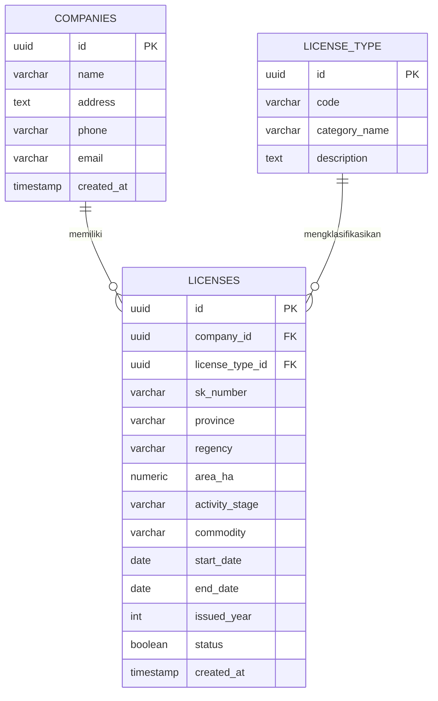

# SIPERTI-MU: Sistem Informasi Perizinan Pertambangan Maluku Utara

<p align="center">
  
</p>

<p align="center">
  <strong>Dinas Energi dan Sumber Daya Mineral (ESDM) Provinsi Maluku Utara</strong><br>
  Aplikasi Pengelolaan CRUD, Monitoring, dan Dashboard Visualisasi Data Izin Usaha Pertambangan (IUP), Izin Pertambangan Rakyat (IPR), dan Izin Usaha Jasa Pertambangan (IUJP).
</p>

---

## 📌 Daftar Isi
- [Gambaran Umum](#-gambaran-umum)
- [Teknologi yang Digunakan](#-teknologi-yang-digunakan)
- [Fitur Utama](#-fitur-utama)
- [Panduan Penggunaan Aplikasi (Tutorial)](#-panduan-penggunaan-aplikasi-tutorial)
  - [A. Panduan untuk Pengunjung Publik (Masyarakat / Pemohon)](#a-panduan-untuk-pengunjung-publik-masyarakat--pemohon)
    - [1. Membaca Executive Dashboard](#1-membaca-executive-dashboard)
    - [2. Menggunakan Filter & Pencarian Cepat](#2-menggunakan-filter--pencarian-cepat)
    - [3. Memeriksa Daftar Izin & Ekspor ke CSV / Excel](#3-memeriksa-daftar-izin--ekspor-ke-csv--excel)
    - [4. Melihat Detail Izin & Perusahaan](#4-melihat-detail-izin--perusahaan)
  - [B. Panduan untuk Administrator Dinas ESDM](#b-panduan-untuk-administrator-dinas-esdm)
    - [1. Masuk (Login) sebagai Admin](#1-masuk-login-sebagai-admin)
    - [2. Menambah Data Izin Baru](#2-menambah-data-izin-baru)
    - [3. Mengubah (Edit) Data Izin](#3-mengubah-edit-data-izin)
    - [4. Menghapus Data Izin](#4-menghapus-data-izin)
    - [5. Mengelola Data Perusahaan](#5-mengelola-data-perusahaan)
    - [6. Keluar (Logout)](#6-keluar-logout)
- [Struktur Basis Data](#-struktur-basis-data)
- [Pengaturan & Menjalankan Aplikasi](#-pengaturan--menjalankan-aplikasi)
- [Keamanan & Kebijakan Akses](#-keamanan--kebijakan-akses)

---

## 📖 Gambaran Umum

**SIPERTI-MU** dirancang untuk memudahkan pemantauan dan administrasi perizinan sektor pertambangan di 9 Kabupaten dan Kota di wilayah Provinsi Maluku Utara. Sistem ini menyajikan visualisasi data yang transparan untuk publik sekaligus menyediakan ruang kerja operasional yang aman bagi staf berwenang Dinas ESDM Maluku Utara.

Data mencakup seluruh spektrum perizinan daerah:
1. **IUP MBLB & Batuan** (Surat Izin Penambangan Batuan / SIPB, Mineral Bukan Logam, Batuan)
2. **IPR** (Izin Pertambangan Rakyat)
3. **IUJP** (Izin Usaha Jasa Pertambangan)

---

## ⚡ Teknologi yang Digunakan

- **Frontend**: [React 19](https://react.dev/), [TypeScript](https://www.typescriptlang.org/), [Vite](https://vitejs.dev/)
- **Styling**: [Tailwind CSS v4](https://tailwindcss.com/) dengan palet resmi emerald/slate dan tema scrollbar kustom
- **Icons**: [Lucide React](https://lucide.dev/)
- **Database & Backend**: [Supabase](https://supabase.com/) (PostgreSQL Relasional dengan Row Level Security)
- **Runtime & Package Manager**: [Bun](https://bun.sh/)

---

## ✨ Fitur Utama

- **Executive KPI Cards**: Ringkasan jumlah IUP, IPR, IUJP, total luas konsesi pertambangan (Hektar), jumlah perusahaan terdaftar, dan persentase kepatuhan izin aktif.
- **Waktu Pembaruan Terkini (WIT)**: Timestamp sinkronisasi data yang diformat presisi dalam Waktu Indonesia Timur (`Asia/Jayapura`, UTC+9).
- **6 Komponen Visualisator Data Interaktif**:
  1. *Tren Penerbitan Izin Per Tahun*: Analisis laju perizinan yang diterbitkan dari tahun ke tahun.
  2. *Status Izin (Donut Chart)*: Komposisi status operasional (Aktif 🟢, Akan Berakhir 🟡, Berakhir 🔴).
  3. *Jumlah Izin Per Kabupaten (Vertical Bar Chart)*: Distribusi persebaran izin dan luas konsesi di seluruh kabupaten/kota.
  4. *Komoditas Tambang Terbanyak (Horizontal Bar Chart)*: Peringkat komoditas utama (Andesit, Sirtu, Batuan, Emas, Nikel, Pasir Besi, dll.).
  5. *Persentase Perizinan Aktif (Circle Radial Gauge)*: Indikator kesehatan izin tambang legal aktif.
  6. *Komposisi Jenis Izin (Donut Chart)*: Proporsi perbandingan antara IUP, IPR, dan IUJP.
- **Multi-Kriteria Filter**: Filter berdasarkan Kabupaten/Kota, Jenis Izin, Status Masa Berlaku, Tahapan Kegiatan, Tahun Terbit SK, dan Komoditas Tambang.
- **Ekspor Data Sekali Klik**: Unduh seluruh atau hasil filter data tabel langsung ke berkas CSV yang kompatibel dengan Microsoft Excel.
- **Keamanan Berlapis (Role-Based)**: Mode baca terbuka untuk publik dan verifikasi password Supabase Auth khusus admin untuk modifikasi data.

---

## 📚 Panduan Penggunaan Aplikasi (Tutorial)

### A. Panduan untuk Pengunjung Publik (Masyarakat / Pemohon)

Sebagai pengguna publik atau masyarakat umum, Anda tidak memerlukan akun dan dapat langsung mengakses informasi perizinan secara transparan.

#### 1. Membaca Executive Dashboard
1. Buka halaman utama aplikasi di browser Anda.
2. Pada bagian atas (*header*), Anda akan melihat tab navigasi:
   - **Dashboard**: Panel ringkasan data statistik dan grafik visualisator.
   - **Kelola Izin**: Tabel data master seluruh surat izin pertambangan.
   - **Data Perusahaan**: Basis data perusahaan pemegang izin tambang.
3. Di tab **Dashboard**, perhatikan:
   - **Banner Status Pembaruan**: Menampilkan tanggal dan jam pembaruan terakhir data Dinas ESDM dalam Waktu Indonesia Timur (WIT).
   - **Kartu Statistik Utama**: Menampilkan total izin per kategori, total luas lahan, dan rasio izin aktif.
   - **6 Grafik Visual**: Klik atau sorot (*hover*) pada bagian diagram batang atau lingkaran untuk melihat jumlah detail data.
   - **Peringatan Masa Berlaku**: Tabel peringatan dini (*warning*) yang menampilkan izin-izin yang akan segera berakhir masa berlakunya (kurang dari 180 hari) atau yang sudah berakhir.

#### 2. Menggunakan Filter & Pencarian Cepat
Untuk menyaring data spesifik (misalnya hanya ingin melihat izin di Kabupaten Halmahera Selatan untuk komoditas Andesit):
1. Masuk ke tab **Dashboard** atau tab **Kelola Izin**.
2. Pada bilah filter di atas tabel/grafik:
   - **Cari Izin**: Ketikkan kata kunci seperti Nomor SK, Nama Perusahaan (PT/CV), atau Komoditas.
   - **Kabupaten / Kota**: Pilih salah satu dari 9 wilayah kabupaten/kota di Maluku Utara.
   - **Jenis Izin**: Pilih kategori izin (*SIPB*, *IUP Batuan*, *IPR*, atau *IUJP*).
   - **Status Keberlakuan**: Pilih *Aktif*, *Akan Berakhir*, atau *Berakhir*.
   - **Tahapan Kegiatan**: Pilih *PRODUKSI*, *OPERASI PRODUKSI*, atau *EKSPLORASI*.
   - **Tahun Terbit**: Pilih tahun penerbitan SK.
   - **Komoditas**: Pilih jenis bahan galian tambang.
3. Seluruh grafik visual dan tabel data akan langsung menyesuaikan secara instan.
4. Klik tombol merah **Bersihkan Filter** untuk mereset seluruh kriteria pencarian ke kondisi awal.

#### 3. Memeriksa Daftar Izin & Ekspor ke CSV / Excel
1. Klik menu navigasi **Kelola Izin**.
2. Anda dapat mengurutkan data (*sort*) dengan mengklik judul kolom pada tabel (misalnya klik **Perusahaan** atau **Masa Berlaku**).
3. Anda dapat mengatur jumlah baris per halaman (10, 15, 25, atau 50 data per halaman).
4. Untuk mengunduh data:
   - Terapkan filter yang Anda inginkan (atau biarkan kosong untuk mengunduh semua data).
   - Klik tombol **Ekspor CSV** di sudut kanan atas tabel.
   - Berkas CSV akan otomatis terunduh ke komputer Anda dengan penamaan tanggal terkini, contoh: `data_perizinan_pertambangan_malut_2026-09-07.csv`.
   - Berkas ini dapat langsung dibuka dan diolah di Microsoft Excel atau Google Sheets.

#### 4. Melihat Detail Izin & Perusahaan
1. Pada tabel izin, klik ikon **Mata (Detail)** di kolom *Aksi*.
2. Modal pop-up akan menampilkan rincian komprehensif: nomor SK, masa berlaku, sisa hari, tahapan, luas wilayah, dan data lengkap perusahaan pemilik izin.
3. Pada tab **Data Perusahaan**, Anda juga dapat mengklik tombol **Lihat Izin** pada masing-masing kartu perusahaan untuk melihat seluruh izin yang terdaftar atas nama perusahaan tersebut.

---

### B. Panduan untuk Administrator Dinas ESDM

Administrator memiliki wewenang untuk menambah, memperbarui, dan menghapus data perizinan maupun perusahaan.

#### 1. Masuk (Login) sebagai Admin
1. Pada bilah navigasi kanan atas, klik tombol **Masuk Admin** (dengan ikon kunci).
2. Masukkan alamat email admin resmi ESDM dan kata sandi yang telah didaftarkan.
3. Klik tombol **Masuk ke Sistem**.
4. Setelah berhasil, indikator di kanan atas akan berubah menampilkan lencana hijau bertuliskan email Anda (misalnya `🛡️ Admin: admin@esdm.malutprov.go.id`) dan seluruh tombol aksi penambahan/pengeditan data akan terbuka.

> [!NOTE]
> Sistem sengaja menonaktifkan pendaftaran publik (*self-registration*) demi menjaga integritas data pemerintah. Akun administrator baru hanya dapat dibuat langsung melalui panel Supabase oleh administrator pusat.

#### 2. Menambah Data Izin Baru
1. Masuk ke tab **Kelola Izin**.
2. Klik tombol hijau **+ Tambah Izin Baru** di kanan atas.
3. Lengkapi formulir pendaftaran izin:
   - **Perusahaan**: Pilih perusahaan pemohon dari daftar (jika perusahaan belum ada, tambahkan terlebih dahulu di tab *Data Perusahaan*).
   - **Jenis Izin**: Pilih klasifikasi izin (*SIPB*, *IUP Batuan*, *IPR*, *IUJP*, dll.).
   - **Nomor SK**: Masukkan nomor keputusan resmi SK izin.
   - **Kabupaten / Kota**: Pilih wilayah lokasi tambang di Maluku Utara.
   - **Luas Wilayah (HA)**: Masukkan luas konsesi lahan dalam satuan hektar (kosongkan jika tidak berlaku, misalnya pada IUJP).
   - **Tahapan Kegiatan**: Pilih tahapan (*PRODUKSI*, *OPERASI PRODUKSI*, atau *EKSPLORASI*).
   - **Komoditas**: Masukkan jenis mineral atau batuan (misal: *Sirtu, Andesit*).
   - **Tahun Terbit**: Masukkan tahun penerbitan SK.
   - **Tanggal Mulai & Tanggal Berakhir**: Tentukan rentang masa berlaku izin.
   - **Status Administratif**: Pastikan tercentang aktif.
4. Klik **Simpan Izin**. Data akan langsung tersimpan di basis data Supabase dan visualisator dashboard akan otomatis terbarui.

#### 3. Mengubah (Edit) Data Izin
1. Temukan izin yang ingin diperbarui melalui fitur pencarian/filter di tab **Kelola Izin**.
2. Klik tombol **Pensil (Edit)** pada baris izin yang bersangkutan.
3. Ubah data yang diperlukan (misalnya pembaruan perpanjangan masa berlaku atau perubahan nomor SK).
4. Klik **Simpan Perubahan**.

#### 4. Menghapus Data Izin
1. Pada baris izin yang ingin dihapus, klik tombol **Tempat Sampah (Hapus)** berwarna merah.
2. Dialog konfirmasi akan muncul menampilkan nomor SK izin untuk mencegah kesalahan klik.
3. Klik **Ya, Hapus Data**. Data akan dihapus secara permanen dari server.

#### 5. Mengelola Data Perusahaan
1. Klik tab **Data Perusahaan**.
2. Untuk menambah perusahaan baru:
   - Klik tombol **+ Tambah Perusahaan**.
   - Masukkan Nama Perusahaan, Alamat, Nomor Telepon, dan Email Kantor.
   - Klik **Simpan**.
3. Untuk mengubah data perusahaan:
   - Klik ikon **Edit** pada kartu perusahaan.
4. Untuk menghapus perusahaan:
   - Klik ikon **Hapus**.
   - *Catatan Keamanan*: Sistem akan menolak penghapusan perusahaan jika perusahaan tersebut masih memiliki izin tambang yang aktif terhubung di database. Hapus atau pindahkan izinnya terlebih dahulu.

#### 6. Keluar (Logout)
1. Setelah selesai melakukan administrasi data, klik tombol **Keluar** berwarna abu-abu di pojok kanan atas navbar.
2. Sistem akan kembali ke **Mode Publik (Hanya Baca)**.

---

## 🗄️ Struktur Basis Data

Aplikasi menggunakan skema PostgreSQL relasional di Supabase:



---

## 🚀 Pengaturan & Menjalankan Aplikasi

### Prasyarat
- [Bun](https://bun.sh/) (sangat direkomendasikan) atau Node.js v18+
- Proyek [Supabase](https://supabase.com/) yang aktif

### 1. Kloning Repositori
```bash
cd d:\Dev\mining-permission
```

### 2. Konfigurasi Environment Variables
Buat file `.env` di direktori utama:
```env
VITE_SUPABASE_URL=https://<your-project-id>.supabase.co
VITE_SUPABASE_ANON_KEY=<your-supabase-anon-key>
```

### 3. Instalasi Dependensi
```bash
bun install
```

### 4. Menjalankan Server Development
```bash
bun run dev
```
Buka browser pada alamat yang ditampilkan (biasanya `http://localhost:5173/` atau `http://localhost:5174/`).

### 5. Membangun untuk Produksi (Build)
```bash
bun run build
```
Hasil kompilasi produksi siap rilis akan tersedia di folder `dist/`.

---

## 🔒 Keamanan & Kebijakan Akses

- **Row Level Security (RLS)**:
  Tabel PostgreSQL dilindungi skrip [`data/secure_rls_policies.sql`](data/secure_rls_policies.sql).
  - Operasi `SELECT`: Terbuka untuk `anon` (publik) dan `authenticated`.
  - Operasi `INSERT`, `UPDATE`, `DELETE`: Khusus untuk role `authenticated`.
- **Manajemen Akun Admin**:
  Petunjuk lengkap pembuatan dan pengelolaan akun staf ESDM dapat dibaca pada berkas [`data/ADMIN_SECURITY_SETUP.md`](data/ADMIN_SECURITY_SETUP.md).

---

<p align="center">
  Dikelola oleh <strong>Dinas Energi dan Sumber Daya Mineral Provinsi Maluku Utara</strong><br>
  © 2026 SIPERTI-MU. Hak Cipta Dilindungi.
</p>
